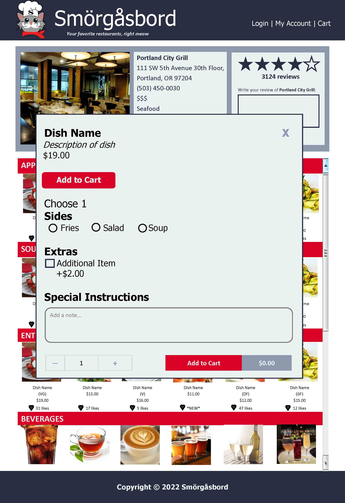

# Smörgåsbord
Project 2 for University of Oregon Full Stack Bootcamp. 

## Creators
* Lillie Lovatt
* <a href="https://github.com/ezaiger">Elisabeth Zaiger</a>
* Angelica Olivares
* Janeth Torres Ruiz
* Matthew Potwora
* Louis D'Agnese

## Project Requirements:  
* Use Node.js and Express.js to create a RESTful API.  
* Use a template engine such as Handlebars.js.  
* Use MySQL and the Sequelize ORM for the database.  
* Have both GET and POST routes for retrieving and adding new data.  
* Deploy using Heroku (with data).  
* Use at least one new library, package, or technology that we haven’t discussed.  
* Have a polished UI.  
* Be responsive.  
* Be interactive (i.e., accept and respond to user input).  
* Must have a folder structure that meets the MVC paradigm.  
* Must include authentication (cookies and express-session).  
* Must protect API keys and sensitive information with environment variables.   
* Have a clean repository that meets quality coding standards (file structure, naming conventions, follows best practices for class/id naming conventions, indentation, quality comments, etc.).  
* Have a quality README (with unique name, description, technologies used, screenshot, and link to deployed application).  

## Wireframe:
* Logo for project created by ezaiger in Adobe Illustrator
* References include: Yelp, Talech, Uber Eats, DoorDash, Portland City Grill (info), Mediterranean Exploration Co. (info), Gado Gado (info), Mayas Taqueria (info)
* Created in Microsoft Publisher, Creative Commons images used

